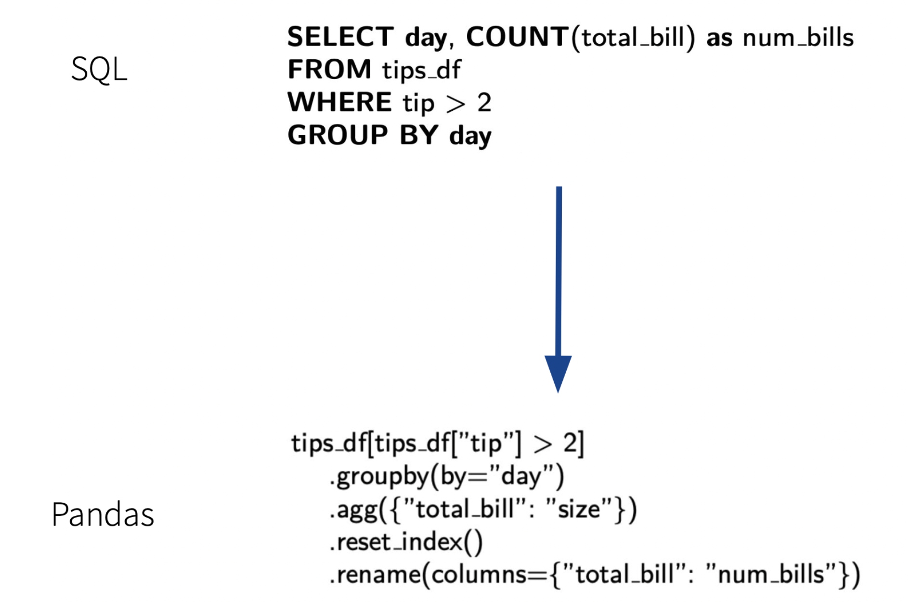

# Research + Projects
## Contents
- [PL research / projects](#pl)
- [Literature reviews](#litreviews)
- [Lectures](#lectures)
- [Other programming projects](#others)

********************************************************************************
## [PL research / projects](#pl)

### Mica: Automated Property-Based Testing for OCaml Modules
- A tool which parses an OCaml module signature and automatically generates 
property-testing code specialized to the interface, checking if two modules
implementing the interface are observationally equivalent 
- Advised by Prof. Benjamin Pierce & Harry Goldstein

### Mechanized Type Soundness Proofs for the Hindley-Milner Type System
- We mechanized type soundness proofs for the Hindley-Milner type system using the 
locally nameless representation in Coq, using the LNGen & Ott tools
- We focused on the non-syntax-directed version of the HM type system, 
as presented in *Practical Type Inference for Arbitrary-Rank Types* (Peyton Jones et al. 2007)
- Joint work with Gary Chen & Zed Wu, advised by Prof. Stephanie Weirich
- Final project for CIS 6700 (Advanced Topics in Programming Languages)

********************************************************************************
## [Literature Reviews](#litreviews)

### Survey: Differentially Private Streaming Algorithms
- Joint work with Kavish Shah, advised by Prof. Michael Kearns
- Final project for CIS 6250 (Theory of Machine Learning)

### Asymptotic Behavior of Cliques in Inhomogeneous W-random Graphs
- Independent study, advised by Prof. Bhaswar Bhattacharya & Anirban Chatterjee        
(via Penn's Undergraduate Research in Probability & Statistics program)

### Proving Pólya's Random Walk Theorem using Electric Network Theory
- Independent study, advised by Eric Goodman         
(via Penn's Directed Reading Program)

********************************************************************************
## [Lectures](#lectures)

### Programming in the Untyped λ-calculus 
- Lecture for CIS 6700 (Advanced Topics in Programming Languages)
- Covered Church & Scott encodings of various datatypes in the untyped λ-calculus

### Parser combinators and the `Applictive` typeclass
- Guest lecture for CIS 1940 (Intro to Haskell)

********************************************************************************
## [Other programming projects](#others)
### Sql-to-Pandas
<!--  -->
- A tool for translating SQL queries into equivalent Pandas queries, implemented in Haskell
- I worked on implementing a parser for SQL queries using monadic parser-combinators, 
and verifying the correctness of the parser using QuickCheck. 
- Joint work with Jason Hom, mentored by Joe Cutler 
- Final project for CIS 5520 (Advanced Programming)

### PennOS 
- A Unix-esque operating system implemented in C (approx. 10,000 lines of code)
- I worked on the OS kernel, in particular implementing the scheduler and handling signals/process statuses, 
as well as integrating the kernel with the shell. 
- Joint work with Mati Davis, John Smith, Rohan Verma, Keshav Ramji
- Final project for CIS 5480 (Operating Systems)

### HomeLab
- Custom VPN + Media server, hosted on a PC salvaged from Penn's E-Waste facilities
- Joint work with Aaron Shurberg [(project slides)](https://docs.google.com/presentation/d/1fL55MLWr2VaVK5deRYRwu6vWKUUKeHCSRbeT5pGzqGA/edit?usp=sharing)
- Final project for CIS 1880 (DevOps)

